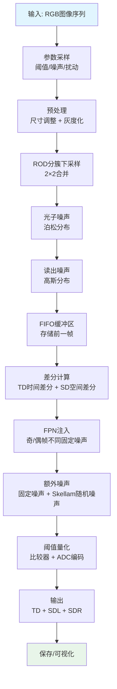

# 天眸传感器仿真器 (sim) 详细分析报告

## 目录

1. [概述](#1-概述)
2. [整体架构](#2-整体架构)
3. [模块详细分析](#3-模块详细分析)
4. [数据流程](#4-数据流程)
5. [输入输出格式](#5-输入输出格式)
6. [硬件对应关系](#6-硬件对应关系)
7. [使用示例](#7-使用示例)

***

## 1. 概述

### 1.1 项目背景

**TianmouCV** 是**天眸(Tianmouc)互补视觉传感器的官方算法库。天眸是全球首款**多通路仿生视觉传感器，具有以下特点：

| 特性   | 参数                       |
| ---- | ------------------------ |
| 最高帧率 | **10000 fps**            |
| 动态范围 | **130 dB**               |
| 带宽压缩 | **90%** (相比传统高速相机)       |
| 灵敏度  | 72%@530nm (可见光)          |
| 数据模态 | 3种：RGB + 时间差分TD + 空间差分SD |

### 1.2 仿真器用途

`sim/` 模块是天眸传感器的**软件仿真器**，主要用途：

- ✅ 在没有真实硬件的情况下生成仿真天眸数据
- ✅ 用于算法开发和测试（重建、光流、分割等）
- ✅ 生成大规模训练数据用于深度学习
- ✅ 验证传感器设计的正确性

### 1.3 文件结构

```
sim/
├── __init__.py              # 导出接口
├── simpleSim_params.json   # 仿真参数配置
├── simple_tmc_sim.py       # 简单版：单图像仿真
└── simple_tmc_sim_advance.py # 高级版：序列仿真，完整噪声模拟
```

***

## 2. 整体架构

### 2.1 整体流程图



### 2.2 传感器架构示意

```
┌─────────────────────────────────────────────────────┐
│ 天眸传感器像素阵列                                   │
│                                                     │
│  ┌──────┐┌──────┐┌──────┐┌──────┐                   │
│  │ Cone││ Cone││ Cone││ Cone│  ←  RGB输出(低帧率)   │
│  └──────┘└──────┘└──────┘└──────┘                   │
│           ┌──────┐┌──────┐                          │
│           │ Rod  ││ Rod  │  ←  TSD输出(高帧率)      │
│           └──────┘└──────┘                          │
└─────────────────────────────────────────────────────┘

Rod工作方式：每个Rod接收2×2像素 → 输出差分数据
```

### 2.3 ROD分簇下采样示意

```
原始图像 (H × W)
┌───┬───┬───┬───┐
│a11│a12│a13│a14│
├───┼───┼───┼───┤
│a21│a22│a23│a24│  ← 每个2×2块合并为一个rod像素
├───┼───┼───┼───┤
│a31│a32│a33│a34│
├───┼───┼───┼───┤
│a41│a42│a43│a44│
└───┴───┴───┴───┘
          ↓
ROD输出 (H/2 × W/4)
┌─────────┬─────────┐
│ (a11+a12│         │
│  a21+a22)/4        │
└─────────┴─────────┘
```

***

## 3. 模块详细分析

### 3.1 参数配置模块

**文件**: [simpleSim\_params.json](../tianmoucv/tianmoucv/sim/simpleSim_params.json)

| 参数                           | 默认值            | 说明          | 仿真硬件       |
| ---------------------------- | -------------- | ----------- | ---------- |
| `adc_bit_prec`               | 8              | ADC量化精度     | **模数转换器**  |
| `dark_fpn_stat.td_odd_mean`  | 0.12           | TD奇帧固定噪声均值  | **固定模式噪声** |
| `dark_fpn_stat.td_odd_std`   | 0.75           | TD奇帧固定噪声标准差 | 工艺不均匀性     |
| `dark_fpn_stat.td_even_mean` | 0.32           | TD偶帧固定噪声均值  | <br />     |
| `dark_fpn_stat.td_even_std`  | 0.64           | TD偶帧固定噪声标准差 | <br />     |
| `sensor_fixed_noise_prob`    | 0.0            | 额外固定噪声概率    | **坏点/列噪声** |
| `sensor_random_noise_prob`   | 0.0            | 随机噪声概率      | **电路随机噪声** |
| `sensor_poisson_lambda`      | 4              | 泊松噪声参数      | **光子散粒噪声** |
| `gray_weight_jitter`         | 0.0            | 灰度权重抖动      | **光照变化**   |
| `sim_threshold_range`        | \[0.005, 0.02] | 差分阈值范围      | **比较器阈值**  |

### 3.2 预处理模块

**功能**:

1. 将输入图像resize到目标尺寸
2. 转换为灰度图
3. 添加灰度权重扰动（可选，模拟光照变化）

**代码位置**: [simple\_tmc\_sim\_advance.py:165-185](../tianmoucv/tianmoucv/sim/simple_tmc_sim_advance.py#L165-L185)

```python
# 灰度化公式
gray_weights = np.array([0.299, 0.587, 0.114], dtype=np.float32)
img_gray = np.tensordot(img_rgb, gray_weights, axes=([-1], [0]))
```

**数据变换**:

- 输入: `[H, W, 3]` uint8 BGR
- 输出: `[rod_height, rod_width]` float32 (0.0-1.0)

**仿真硬件**: **Rod光敏单元** → Rod只对亮度敏感，不需要色彩信息

### 3.3 ROD分簇下采样模块

**功能**: 模拟真实传感器的ROD阵列结构，将2×2像素合并为一个rod像素

**代码位置**: [simple\_tmc\_sim\_advance.py:284-291](../tianmoucv/tianmoucv/sim/simple_tmc_sim_advance.py#L284-L291)

```python
# 2×2像素平均合并
etron_img_bin = (img_diff_sim[0::2, 0::2] + 
                 img_diff_sim[1::2, 0::2] + 
                 img_diff_sim[0::2, 1::2] + 
                 img_diff_sim[1::2, 1::2]) / 4

# 交错排列
etron_img_rod[0::2, :] = etron_img_bin[0::2, 0::2]
etron_img_rod[1::2, :] = etron_img_bin[1::2, 1::2]
```

**尺寸变换**:

| 输入                  | 输出                       |
| ------------------- | ------------------------ |
| 高度: `sensor_height` | 高度: `sensor_height // 2` |
| 宽度: `sensor_width`  | 宽度: `sensor_width // 4`  |

**示例**:

- 输入: 640 × 320
- 输出: 160 × 160 **(面积缩小为1/4)**

**仿真硬件**: **ROD (Receptive-Field Organized Detector) 阵列** → 合并像素提高灵敏度，降低带宽

### 3.4 噪声模拟模块

#### 3.4.1 光子散粒噪声

```python
img_gray_tensor = torch.poisson(img_gray_tensor)
```

**仿真硬件**: **光子量子特性** → 光子到达服从泊松分布

#### 3.4.2 读出噪声

```python
etron_img_rod = etron_img_rod + torch.normal(mean=0, std=0.008, ...)
```

**仿真硬件**: **读出电路热噪声** → 电路电子热扰动

#### 3.4.3 固定模式噪声(FPN)

```python
# 根据奇帧偶帧选择不同噪声
if sim_cnt % 2 == 0:
    td_fpn = fpn['td_even']
    sdl_fpn = fpn['sdl_even']
    sdr_fpn = fpn['sdr_even']
else:
    td_fpn = fpn['td_odd']
    sdl_fpn = fpn['sdl_odd']
    sdr_fpn = fpn['sdr_odd']

temp_diff += td_fpn
```

**仿真硬件**: **制造工艺不均匀性** → 每个比较器的固有偏置不同。奇帧偶帧由不同电路读出。

#### 3.4.4 额外随机噪声 (Skellam分布)

```python
p1 = torch.poisson(...)
p2 = torch.poisson(...)
skellam_noise = (p1 - p2) * scale
```

**Skellam分布** = 两个独立泊松分布之差 → 模拟多个独立噪声源的综合效应

### 3.5 FIFO缓冲区

**功能**: 保持深度为2的缓冲区，存储当前帧和前一帧

**代码位置**: [simple\_tmc\_sim\_advance.py:35-45](../tianmoucv/tianmoucv/sim/simple_tmc_sim_advance.py#L35-L45)

```python
def push_to_fifo(tensor, x):
    return torch.cat((tensor[1:], x))
```

使用方式:

```python
rod_v_buf = torch.zeros(size=(2, rod_height, rod_width))
...
rod_v_buf = push_to_fifo(rod_v_buf, img_diff_sim)
# 现在 rod_v_buf[0] = 前一帧, rod_v_buf[1] = 当前帧
```

**仿真硬件**: **行缓存/移位寄存器** → 硬件需要存储前一帧数据来计算差分

### 3.6 差分计算模块

#### 3.6.1 TD - 时间差分

# 3.6.2 SD计算：空间差分（SDL & SDR）

### 3.6.2.1 功能概述

SD（Spatial Difference）计算模块负责模拟天眸传感器交错式像素阵列的空间梯度提取逻辑。基于前一帧与当前帧的Rod像素，分别计算SDL（左向空间差分）与SDR（右向空间差分），最终输出与硬件格式完全一致的int8差分图。

核心作用：提取图像边缘与纹理特征，为后续视觉任务提供高帧率、高压缩率的空间结构信息。

硬件映射：对应传感器内SDL/SDR专用比较器阵列，处理奇偶行交错布局的像素差分。

### 3.6.2.2 核心差分规则（严格对应传感器硬件）

基于传感器交错行布局（ROD 采样时：奇数行取奇数列，偶数行取偶数列且向左平移 1-pixel），在 `sd_cal` 矩阵中的垂直和对角操作在物理空间上映射为 **Center - Left** 和 **Center - Right**。

#### 核心差分定义（被减数必为奇数行）

| 差分类型   | 物理含义               | 行类型             | 差分公式（像素索引 (i,j)）                        | 说明                    |
| ------ | ------------------ | --------------- | --------------------------------------- | --------------------- |
| SDL    | **Center - Left**  | 偶数行（0, 2, 4...） | SDL\[i,j] = Gray\[i+1,j] - Gray\[i,j]   | Gray\[i+1,j] 为奇数行（中心） |
| <br /> | <br />             | 奇数行（1, 3, 5...） | SDL\[i,j] = Gray\[i,j] - Gray\[i+1,j]   | Gray\[i,j] 为奇数行（中心）   |
| SDR    | **Center - Right** | 偶数行（0, 2, 4...） | SDR\[i,j] = Gray\[i+1,j] - Gray\[i,j+1] | Gray\[i+1,j] 为奇数行（中心） |
| <br /> | <br />             | 奇数行（1, 3, 5...） | SDR\[i,j] = Gray\[i,j] - Gray\[i+1,j+1] | Gray\[i,j] 为奇数行（中心）   |

> **注**：由于 ROD 奇偶行错位，`sd_cal` 矩阵中的垂直相邻像素在物理上并非完全垂直，而是包含了水平偏移。因此，垂直减法等同于水平梯度提取。

#### 关键约束

1. 边界处理：最后一行（i = H-1）与最后一列（j = W-1）无有效邻居，差分结果强制置0。
2. 数据范围：输入为归一化灰度图（float32，0.0\~1.0），输出为量化后的int8（-128 \~ +127）。
3. 布局适配：通过奇偶行差分方向的差异化定义，完美适配传感器Rod阵列的交错布局，避免梯度方向颠倒。

### 3.6.2.3 与仿真流程的集成逻辑

SD计算模块位于FIFO缓冲区之后、FPN噪声注入之前，输入为经过ROD下采样、添加光子噪声与读出噪声的Rod灰度图（rod\_img），输出为原始空间差分图，后续流程如下：

1. 输入：rod\_img（float32，H/2 × W/4）→ 经灰度化与ROD采样后的单通道图。
2. SD计算：生成sdl与sdr（int8，H/2 × W/4）。
3. 噪声注入：为sdl/sdr添加固定模式噪声（FPN），区分奇帧/偶帧（sim\_cnt % 2 == 0 用偶帧FPN，否则用奇帧FPN）。
4. 额外噪声：叠加固定坏点噪声与Skellam分布随机噪声，模拟硬件真实干扰。
5. 阈值量化：通过阈值过滤低幅度噪声，最终输出稀疏编码后的SD数据（仅保留显著边缘）。

### 3.6.2.4 数据格式与硬件对齐

| 输出张量 | 数据类型 | 形状            | 值域           | 硬件对应关系                     |
| ---- | ---- | ------------- | ------------ | -------------------------- |
| SDL  | int8 | （H/2, W/4）    | -128 \~ +127 | 传感器垂直空间差分比较器输出             |
| SDR  | int8 | （H/2, W/4）    | -128 \~ +127 | 传感器水平空间差分比较器输出             |
| 组合输出 | int8 | （H/2, W/4, 2） | -128 \~ +127 | 与真实硬件TSD数据格式完全一致，可直接用于算法测试 |

### 3.6.2.5 仿真验证标准

1. 形状一致性：输出sdl/sdr形状与输入sd\_cal完全一致，边界（最后一行/列）全为0。
2. 符号正确性：奇偶行差分结果符合核心定义，无方向颠倒。
3. 值域合规性：输出数据严格在int8值域（-128 \~ +127）内，无溢出。
4. 硬件适配性：差分规则与传感器交错行布局匹配，可直接对接后续ISP处理流程。

> （注：文档部分内容可能由 AI 生成）

### 3.7 阈值量化模块

**功能**:

1. 阈值判断：差分绝对值低于阈值置零（稀疏编码）
2. ADC量化：浮点数差分转换为整数输出

**代码位置**: [simple\_tmc\_sim\_advance.py:79-91](../tianmoucv/tianmoucv/sim/simple_tmc_sim_advance.py#L79-L91)

```python
def diff_quant(diff, th):
    max_digi_num = 2 ** (adc_bit_prec - 1)  # 8bit → 128
    lin_lsb = 1.0 / max_digi_num            # LSB = 1/128
    
    # 阈值处理：低于阈值置零
    diff_th = (diff - th) * (diff > th) + (diff + th) * (diff < -th)
    
    # 量化：浮点 → 整数
    diff_quantized = diff_th / lin_lsb
    diff_quantized = diff_quantized.clip(min=-max_digi_num, max=max_digi_num)
    diff_quantized = 取整 → 转换为int8
    
    return diff_quantized
```

**量化原理**:

| 差分范围            | 输出int8 (8bit ADC) |
| --------------- | ----------------- |
| diff > th       | 正整数               |
| -th ≤ diff ≤ th | 0                 |
| diff < -th      | 负整数               |

- 输入: `[H, W]` float32
- 输出: `[H, W]` int8，范围 \[-128, 127]
- **仿真硬件**:
  - 阈值处理 → **比较器**
  - 量化 → **模数转换器(ADC)**

### 3.8 TD符号分离模块

将TD的正负值分离到两个通道。

**代码位置**: [simple\_tmc\_sim.py:23-29](../tianmoucv/tianmoucv/sim/simple_tmc_sim.py#L23-L29)

```python
def tdiff_split(td_,cdim = 0):
    td_pos = td_.clone()
    td_pos[td_pos<0] = 0
    td_neg = td_.clone()
    td_neg[td_neg>0] = 0
    td = torch.stack([td_pos,td_neg],dim=cdim)
    return td
```

- 输入: `[H, W]` td
- 输出: `[2, H, W]` → \[正差分通道, 负差分通道]
- **原因**: 硬件上正负差分由不同比较器处理，分开存储

***

## 4. 数据流程

### 4.1 数据流图

```
┌─────────────────────────────────────────────────────────────────────────┐
│                    输入: 单帧RGB图像                                     │
│  Shape: [H, W, 3]  dtype: uint8 (0-255)                                 │
└────────────┬────────────────────────────────────────────────────────────┘
             ↓
    ┌───────▼─────────┐
    │   灰度化预处理   │
    │  [H, W] float32 │
    └───────┬─────────┘
             ↓
    ┌───────▼──────────────┐
    │  ROD 2×2分簇下采样    │
    │ [H/2, W/4] float32   │
    └───────┬──────────────┘
             ↓
    ┌───────┴──────────────┐
    │  添加光子噪声+读出噪声  │
    │  [H/2, W/4] float32   │
    └───────┬──────────────┘
             ↓
    ┌───────▼──────────────┐
    │   FIFO push_to_fifo   │
    │  [2, H/2, W/4]        │ ← 缓冲区: [前一帧, 当前帧]
    └───────┬──────────────┘
             ↓
    ┌───────┼──────────────┐
    │       ↓              ↓
    │    TD计算         SD计算  
    │  [H/2, W/4]    [H/2, W/4] × 2 (SDL + SDR)
    └───────┬──────────────┘
             ↓
    ┌───────▼──────────────┐
    │   添加FPN固定噪声      │
    │  (奇帧/偶帧不同)       │
    └───────┬──────────────┘
             ↓
    ┌───────▼──────────────┐
    │  添加额外噪声         │
    │  固定噪声 + Skellam   │
    └───────┬──────────────┘
             ↓
    ┌───────▼──────────────┐
    │   阈值 + ADC量化      │
    │  [H/2, W/4] int8 × 3  │ ← TD + SDL + SDR
    └───────┬──────────────┘
             ↓
    ┌───────▼──────────────┐
    │    保存到文件         │
┌─────────────────────────────────────────────────────────────────────────┐
│                    输出: tsdiff_{sim_cnt}.npy                            │
│  Shape: [rod_height, rod_width, 3]  dtype: int8                          │
│  [:,:,0] → TD,  [:,:,1] → SDL,  [:,:,2] → SDR                            │
└─────────────────────────────────────────────────────────────────────────┘
```

### 4.2 尺寸变换汇总表

| 阶段      | 高度                 | 宽度                | 通道 | 数据类型    |
| ------- | ------------------ | ----------------- | -- | ------- |
| 输入RGB   | H = sensor\_height | W = sensor\_width | 3  | uint8   |
| 灰度化     | H                  | W                 | 1  | float32 |
| ROD下采样  | **H//2**           | **W//4**          | 1  | float32 |
| FIFO缓冲区 | 2 × (H//2)         | W//4              | 2  | float32 |
| TD输出    | H//2               | W//4              | 1  | int8    |
| SDL输出   | H//2               | W//4              | 1  | int8    |
| SDR输出   | H//2               | W//4              | 1  | int8    |
| 保存文件    | H//2               | W//4              | 3  | int8    |
| SDXY输出  | H//2               | **W//2**          | 2  | float32 |

**示例**: sensor\_width = 640, sensor\_height = 320

| 阶段         | 高度      | 宽度      |
| ---------- | ------- | ------- |
| 输入         | 320     | 640     |
| ROD输出      | **160** | **160** |
| TD/SDL/SDR | 160     | 160     |
| SDXY       | 160     | **320** |

***

## 5. 输入输出格式

### 5.1 输入

#### 5.1.1 高级版: run\_sim()

```python
from tianmoucv.sim import run_sim
run_sim(
    datapath='/path/to/images',         # 图像文件夹
    sensor_width=640,                   # 目标宽度
    sensor_height=320,                 # 目标高度
    device=device,                      # cuda/cpu
    display=False,                      # 是否显示
    save=True,                          # 是否保存
    save_path='./output'               # 保存路径
)
```

**输入要求**:

- `datapath` 文件夹中包含 `.png` 或 `.jpg` 图像
- 文件名按数字排序，程序会自动提取数字排序
- 每张图像是标准RGB彩色图像，8bit (0-255)
- 图像按时间顺序排列（视频帧序列）

#### 5.1.2 简单版: run\_sim\_singleimg()

```python
from tianmoucv.sim import run_sim_singleimg
result = run_sim_singleimg(
    img,                # [H, W, 3] numpy array
    sensor_width=640,
    sensor_height=320,
    xy=True
)
```

**输入**: 单张RGB图像 `[H, W, 3]` numpy

### 5.2 输出

#### 5.2.1 输出目录结构 (run\_sim)

```
save_path/
├── rgb/                      # RGB参考帧
│   └── frame_0000.png        # 每cop_cone_skip(=10)帧保存一个
│   └── frame_0001.png
│
├── tsdiff/                   # 时间空间差分数据
│   └── tsdiff_0.npy          # 每个帧一个文件
│   └── tsdiff_1.npy
│
├── noisy_gt/                 # 带噪声的ground truth
│   └── noisyGT_0.npy
│   └── noisyGT_1.npy
│
├── viz/                      # 可视化结果
│   └── sim_viz_0.png
│   └── sim_viz_1.png
│
└── fpn.npy                   # 本次仿真的固定模式噪声
```

#### 5.2.2 单个文件格式

**(1) tsdiff/{sim\_cnt}.npy**

```python
# 读取后shape: [rod_height, rod_width, 3]
tsdiff = np.load('tsdiff_0.npy')

td = tsdiff[:, :, 0]      # 时间差分 → int8
sdl = tsdiff[:, :, 1]     # 垂直空间差分 → int8
sdr = tsdiff[:, :, 2]     # 水平空间差分 → int8
```

- 数据类型: `int8`
- 取值范围: `-128` ∼ `+127`
- 0表示差分低于阈值，不输出

**(2) noisy\_gt/noisyGT\_{sim\_cnt}.npy**

```python
# shape: [rod_height, rod_width]
gt = np.load('noisyGT_0.npy')
```

- 数据类型: `float32`
- 内容: 添加所有噪声后的rod强度图
- 用途: 作为重建任务的ground truth

**(3) rgb/frame\_xxxx.png**

- 尺寸: `[sensor_height, sensor_width, 3]`
- 类型: `uint8` RGB
- 说明: 每10帧保存一个完整RGB帧，对应sensor的cone输出

**(4) fpn.npy**

```python
# shape: [rod_height, rod_width, 6]
fpn = np.load('fpn.npy')

# 通道顺序:
# [:, :, 0] → td_odd
# [:, :, 1] → sdl_odd
# [:, :, 2] → sdr_odd
# [:, :, 3] → td_even
# [:, :, 4] → sdl_even
# [:, :, 5] → sdr_even
```

- 内容: 本次仿真使用的固定模式噪声
- 用途: 可用于后续噪声分析

#### 5.2.3 run\_sim\_singleimg() 返回值

当 `xy=True`:

```python
img_ref_tensor, img_target_tensor, td, sd0, sd1 = run_sim_singleimg(...)
```

| 返回值                 | Shape           | Type    | 说明                   |
| ------------------- | --------------- | ------- | -------------------- |
| `img_ref_tensor`    | `[3, H, W]`     | float32 | 前一帧（平移后）             |
| `img_target_tensor` | `[3, H, W]`     | float32 | 当前帧                  |
| `td`                | `[2, H/2, W/2]` | int8    | TD分离正负 → \[正TD, 负TD] |
| `sd0`               | `[2, H/2, W/2]` | float32 | 前一帧SD → \[sdl, sdr]  |
| `sd1`               | `[2, H/2, W/2]` | float32 | 当前帧SD → \[sdl, sdr]  |

***

## 6. 硬件对应关系总表

| 软件模块                       | 对应天眸硬件    | 功能              |
| -------------------------- | --------- | --------------- |
| `simpleSim_params.json` 配置 | 配置寄存器     | 存储阈值、ADC精度等参数   |
| 灰度化                        | Rod光敏单元   | Rod只响应亮度，不需要色彩  |
| 2×2分簇下采样                   | ROD感光阵列   | 合并像素提高灵敏度，降低分辨率 |
| 泊松噪声                       | 光子量子特性    | 光子散粒噪声          |
| 高斯读出噪声                     | 读出电路      | 电路热噪声           |
| FIFO缓存                     | 移位寄存器/行缓存 | 存储前一帧数据         |
| TD计算                       | 时间差分比较器   | 检测帧间强度变化        |
| SDL计算                      | 垂直空间差分比较器 | 检测垂直方向梯度        |
| SDR计算                      | 水平空间差分比较器 | 检测水平方向梯度        |
| FPN奇/偶帧分离                  | 固定模式噪声    | 制造工艺不均匀性        |
| 额外固定噪声                     | 列/行驱动电路   | 系统固定偏移          |
| Skellam噪声                  | 混合噪声源     | 多个独立噪声源的综合效应    |
| 阈值处理                       | 比较器       | 稀疏编码，只输出显著变化    |
| ADC量化                      | 模数转换器     | 模拟差分 → 数字编码     |
| TD符号分离                     | 双比较器设计    | 正负差分分开处理        |
| SD2XY变换                    | 后处理单元     | 原生格式 → 梯度格式     |

***

## 7. 使用示例

### 7.1 完整视频仿真

```python
from tianmoucv.sim import run_sim
import torch

# 设备选择
device = torch.device('cuda' if torch.cuda.is_available() else 'cpu')

# 参数设置
data_path = './input_frames'      # 输入图像文件夹
sensor_width = 640               # 传感器宽度
sensor_height = 320              # 传感器高度

# 运行仿真
run_sim(
    data_path, 
    sensor_width, 
    sensor_height,
    device, 
    display=False, 
    save=True, 
    save_path='./output_tianmouc'
)
```

### 7.2 单帧测试

```python
from tianmoucv.sim import run_sim_singleimg
import cv2

# 读取图像
img = cv2.imread('test.jpg')

# 运行仿真
img_pre, img_curr, td, sd0, sd1 = run_sim_singleimg(
    img, 
    sensor_width=640, 
    sensor_height=320,
    xy=True
)

print(f"TD shape: {td.shape}")      # → [2, 160, 320]
print(f"SD0 shape: {sd0.shape}")    # → [2, 160, 160]
print(f"SD1 shape: {sd1.shape}")    # → [2, 160, 160]
```

### 7.3 从SD获取XY梯度

```python
from tianmoucv.isp import SD2XY
import torch

# sd shape: [2, H, W] → [sdl, sdr]
sd = sd1  # 当前帧SD
sdx, sdy = SD2XY(sd)

print(f"sdx shape: {sdx.shape}")    # → [H/2, W/2]
print(f"sdy shape: {sdy.shape}")    # → [H/2, W/2]
# sdx = x方向梯度，sdy = y方向梯度
```

***

## 8. 版本对比

| 特性    | simple\_tmc\_sim.py   | simple\_tmc\_sim\_advance.py |
| ----- | --------------------- | ---------------------------- |
| 输入    | 单张图像                  | 图像序列文件夹                      |
| 输出    | 直接返回tensor            | 保存文件到磁盘                      |
| FPN噪声 | ❌ 不支持                 | ✅ 支持奇/偶帧                     |
| 泊松噪声  | ✅ 可选                  | ✅ 默认开启                       |
| 使用场景  | 快速测试                  | 批量生成数据集                      |
| 入口函数  | `run_sim_singleimg()` | `run_sim()`                  |

***

## 总结

该仿真器完整模拟了天眸互补视觉传感器的工作流程：

1. **仿生架构** → 遵循真实硬件的ROD分簇结构，2×2像素合并
2. **完整噪声模型** → 包括光子噪声、读出噪声、固定模式噪声等多种噪声
3. **稀疏编码** → 只有超过阈值的变化才输出，大幅压缩带宽
4. **多模态输出** → 同时输出时间差分(TD)和空间差分(SD)
5. **数据兼容性** → 输出格式与真实硬件完全一致，仿真数据可直接用于算法开发

仿真器生成的TSD数据保留了**运动信息**(TD)和**边缘纹理信息**(SD)，同时通过稀疏编码实现了**90%带宽压缩**，这正是天眸传感器能够实现**10000fps**高速成像的核心原理。
